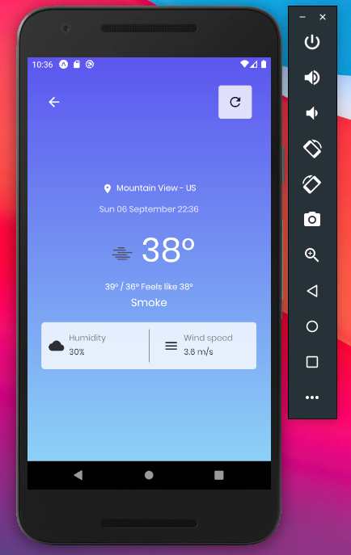

<h1 align="center">
    
</h1>

<h4 align="center">
  Weather App
</h4>
<p align="center">
  

  

  <a href="https://github.com/gagigante/weather-app/commits/master">
    
  </a>

  <a href="https://github.com/gagigante/weather-app/issues">
    
  </a>

  

<p align="center">
  <a href="#rocket-technologies">Technologies</a>&nbsp;&nbsp;&nbsp;|&nbsp;&nbsp;&nbsp;
  <a href="#runner-how-to-run">How to run</a>&nbsp;&nbsp;&nbsp;|&nbsp;&nbsp;&nbsp;
  <a href="#-project">Project</a>&nbsp;&nbsp;&nbsp;|&nbsp;&nbsp;&nbsp;
  <a href="#-how-to-contribute">How to contribute</a>&nbsp;&nbsp;&nbsp;|&nbsp;&nbsp;&nbsp;
  <a href="#memo-license">License</a>
</p>

<br>

<p align="center">
  

  
</p>

## :rocket: Technologies

This project was developed with the following techs:

- [React Native](https://reactnative.dev/)
- [Typescript](https://www.typescriptlang.org/)
- [Expo](https://expo.io/)
- [Styled Components](https://styled-components.com/)
- [React Navigation](https://reactnavigation.org/)
- [Axios](https://www.npmjs.com/package/axios)
- [Date fns](https://date-fns.org/)
- [Eslint](https://eslint.org/)
- [Prettier](https://prettier.io/)
- [Open weather](https://openweathermap.org/)

## 💻 Project

This project is a simple weather forecast application based on the user current location

## :runner: How to run

First you need to get an api key on https://openweathermap.org/ and edit `apiClient.ts`
```
  // ./src/services/apiClient.ts at line 8

  apiClient.defaults.params.appid = 'YOUR_API_KEY';
```

Install dependencies
```
  $ yarn

  or

  $ npm install
```

Start server
```
  $ yarn start

  or

  $ npm start
```

When the server starts your will be able to run the app on your device through the expo app. So you will need to install it

https://play.google.com/store/apps/details?id=host.exp.exponent&hl=pt_BR
https://apps.apple.com/br/app/expo-client/id982107779


## 🤔 How to contribute

- Fork this repo;
- Create a branch for your new feature: `git checkout -b my-feature`;
- Commit your changes: `git commit -m 'feat: My brand new feature'`;
- Push it to your branch: `git push origin my-feature`.

After merge of your pull request, you can delete your branch.

## :memo: License

This project is under MIT license. See the file [LICENSE](LICENSE) for details.

---
